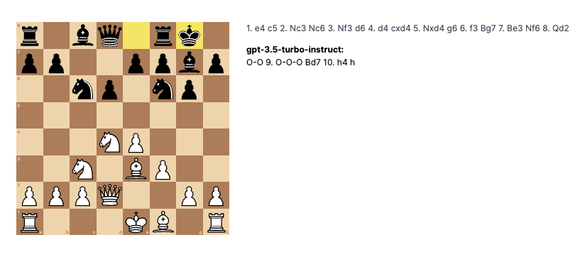
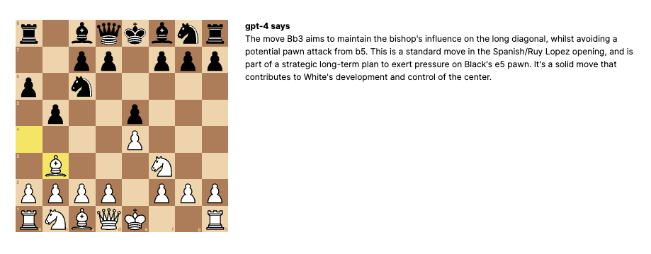

# 0-0-0 GPT Chess

Play chess against gpt-3.5-turbo-instruct in your browser.

    

 

Have gpt-4 analyze positions and explain them in natural language.

    

**UPDATE 10/13/2023: gpt-3.5-turbo-instruct is far stronger than GPT-4 and plays valid moves.** 
However to get best results, just use the model as a straightforward completion of the PGN. Do not give additional board context or chain-of-thought. s/o to [Grant Slatton](https://twitter.com/GrantSlatton/status/1703913578036904431).

 

### The dream

As a bad chess player, one of the barriers to improving is the effort required in order to analyze games. Even with engine lines, bad players cannot easily understand the key ideas between good and bad moves. A chess-playing LLM could be an impossibly patient, accessible training partner that reduces that friction.

I am also generally interested in direct integrations of LLM's within non-text applications.

Unfortunately, GPT-4 at the moment is pretty bad at chess, often proposing invalid moves and obvious blunders. From my very limited testing, any good performance is easily explained by regurgitating pre-trained theory. So, this will be a fun and easy way to see how it improves over time in this high complexity task.

 

### Improvements

- [ ] Combine a conventional engine with GPT. Have engine own evaluation of lines and lean on GPT to explain them.
    * This was the original idea but I didn't immediately find a JS engine I wanted to integrate. Also, I don't think GPT-4 is good enough to be useful in this way yet.
- [ ] Chat with GPT in analysis mode
- [ ] Pick which model to play against
- [ ] Expose and customize prompts
- [ ] Load and export games w/ GPT commentary
